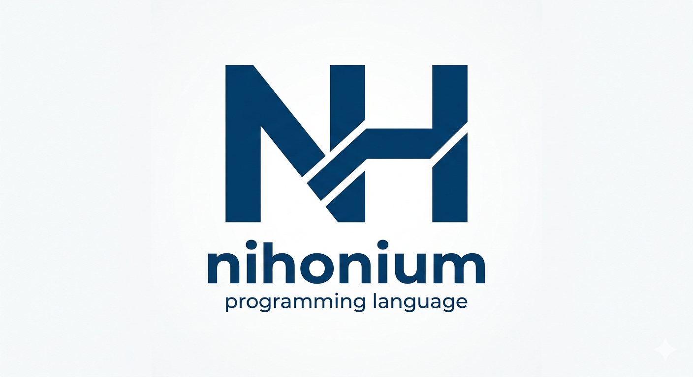

Official interpreter of the Nihonium programming language

Nihonium is a high-level hybrid interpreted programming language designed by Younes Bendimerad, a 16 year old high school student in Munich.
This project is still in development.

## Installing

Clone the repository
```
git clone https://github.com/ixodev/interpreter.git
```
Start the interpreter by running
```
python nihonium.py <your-program.nihonium>
```

Or if you just want to run the Nihonium interactive shell:
```
python nihonium.py --shell
```

## How to use

You can use additional command line arguments when starting the interpreter.

#### --pretty-print-ast
Displays a Nihonium program's internal representation without running it.

#### --debug
Enables debug mode.

#### --natives
Link a native python file to a Nihonium program

#### --disable-default-natives
Disable default linking to the native standard library, defined in "nihonium/natives.py"

#### --shell
Runs the Nihonium interactive shell

## Quick Learning

### Variables

Nihonium is a dynamically-typed programming language, so variables are created as following:
```
var variable = value
```
The value can be an atomic expression (numbers, strings, function calls, or other declared variables), a binary or an unary expression.

To order a value to an already-declared variable:
```
variable = value
```

### Functions

Functions in Nihonium are declared as following:
```
function func(a, b, c) {
    ...
    return value
}
```

### Operators

Nihonium supports widely all the arithmetical, binary and unary operators.

#### Arithmetical operators
| Operator      | Function      |
| ------------- |:-------------:|
| +             | add           |
| -             | subtract      |
| *             | multiply      |
| /             | divide        |

#### Logical operators
| Operator      | Function      |
| ------------- |:-------------:|
| &             | bitwise and   |
| \|            | bitwise or    |
| ^             | xor           |


#### Bitwise operators
| Operator      | Function      |
| ------------- |:-------------:|
| &&            | logical and   |
| \|\|          | logical or    |

#### Comparison operators
| Operator |      Function      |
|----------|:------------------:|
| ==       |      equality      |
| ref      | reference equality |
| !=       |    non-equality    |
| >        |      greater       |
| <        |      smaller       |
| <=       |    smaller inc.    |
| >=       |    greater inc.    |


### Unary Operators
| Operator      | Function      |
| ------------- |:-------------:|
| !             | logical negation |
| ~             | bitwise negation |


### Conditions

In Nihonium, conditions are declared as following:

```
if expr {
    ...
}
else {
    ...
}
```

> ⚠️ **Warning**: There is no "else if" in Nihonium

### Loops
In Nihonium, loops are declared as following:

```
while condition {
    ...
}
```

```
for var x = 0; x < n; x++ {
    ...
}
```

### Memory managing
The ```delete``` keyword can be used to delete a variable from a symbol table, which is associated to a scope. The deleted variable will not be available in the scope after the use of the ```delete``` statement. All further references to this name, if not re-declared, will throw exceptions.

```
var variable = 5
println(variable)
delete variable
// Exception
println(variable)
```

### Importing modules
In Nihonium, you can import a module like by using the keyword ```import```.
The standard library modules are located in the package ```stdlib```.

```
import stdlib.stdio
import stdlib.math
```

Here, the standard library module ```stdlib.stdio``` provides basic I/O functions and objects, such as standard output/input/error files, and functions as ```println```. The ```stdlib.math``` module provides classic mathematical functions and constants, such as ```pi```, ```e```, ```ln```, ```sqrt```, or trigonometric functions.

If a function or global variable name from an imported module conflicts with a local definition, the imported symbol will be shadowed by the local symbol. 

### I/O Operation Keywords

Nihonium provides 3 keywords to perform basic I/O operations:
```write```, ```read``` and ```flush```.
The ```write``` keyword accepts two operands, both separated with a comma.
The ```flush``` keyword is used to flush a file.

```
// Writes the string "Hello" on the file "file"
write file, "Hello"

// Writes hello on the standard output, stdout
write _stdout_, "hello"

// clears the standard output's buffer
flush _stdout_
```

The ```read``` keyword accepts two operands:
```
// Reads up to 4096 bytes from the file "file"
read file, 4096

// Reads up to 4096 bytes from the standard input, stdin
read _stdin_, 4096
```

For the keywords ```read```, ```write``` and ```flush```, the provided file object must be an internal instance of a class which inherits of the ```IOStream``` class, defined in ```natives.py```. Otherwise, an exception will be thrown.

### Unsafe sections
In Nihonium, the ```unsafe``` keyword can be used to declare a code block as unsafe. Some Nihonium keywords, like ```del```, cannot be used outside of an unsafe section.

```
unsafe {
    ...
}
```

### Lambda functions

To declare a lambda function in Nihonium, you can write it like this:

```
var lambda = x -> (x * x)
println(lambda(2))
var lambda2 = x, y -> (x + y)
println(lambda2(1, 1))
var lambda3 = z -> z * 2
println(lambda3(-4))
```

> ⚠️ **Warning**: The expression that will be returned by the lambda has to be written between parentheses: ```(``` and ```)```, after the ```->``` token.

You can add, multiply, divide, subtract, or more generally apply every binary operator between lambda functions, or apply every unary operator to lambda functions.
The expression ```lambda + lambda3``` would return a new lambda function, which associates to x ```lambda(x) + lambda3(x)```.
To apply a binary operator between two lambda functions, they must have the same amount of parameters. Otherwise, an exception will be thrown.
The expression ```lambda + lambda2``` would throw an exception.

To apply an unary operator to a lambda function, you can simply write it like this:
```
var newLambda = ~lambda3
println(newLambda(43))
```

The expression ```~lambda3``` returns a new lambda function, which to x associates ```~(lambda3(x))```.

It is also possible to apply a binary operator between a function and a lambda function.
```
function f(x) {
    return x + 2
}

var x = (x -> x * 2) + f
```

The lambda function ```x``` is a lambda function, which to x associates ```2 * x + f(x)```.
> ⚠️ **Warning**: All binary operators are supported between lambda functions, except for the comparison operators (```==```, ```!=```, ```>```, ```>=```, ```<```, ```<=```), which are not defined for this type due to their absurdity in this context.

> ⚠️ **Warning**: Binary operators on functions are only allowed when at least one operand is an inline (non-generalized) lambda, in order to preserve local type inference and avoid ambiguities related to polymorphic functions.   

> ⚠️ **Warning**: Nihonium does not support direct application of anonymous function expressions, (e.g. ```x -> x * x)(3)``` or ```(x + y)(2)``` (when x and y are two callable objects)), in order to prevent the accumulation of higher-order function expressions within a single expression and to preserve readability and predictable evaluation.

### Complex numbers
Nihonium supports natively complex numbers. The ```im``` keyword is evaluated as an expression which returns the imaginary unit, i. e. the complex number ```0 + 1i```.

To declare a complex number, the ```im``` keyword can be used:  

```var z = 2 + 3 * im```  

In this case the real part is 2 and the imaginary part is 3.  

The ```complex``` keyword can be used to create complex numbers:

```z = complex(a, b)```, where ```a``` and ```b``` are two instances of subclasses of ```RealNumber```, and where ```a``` is the real part and ```b``` the imaginary part.  

> ⚠️ **Warning**: ```complex``` is a reserved keyword that is lowered to a builtin AST node representing a complex number constructor. It behaves syntactically like a function call but is not a user-defined or runtime function.  

To calculate the modulus of a complex number, the ```abs``` function from ```stdlib.math``` can be used.
The ```phase``` function from ```stdlib.math``` returns the phase of a complex number within the interval [ - $\pi$ ; $\pi$ ].

### Native functions
Nihonium functions can call Python functions or instantiate Python classes. By default, the native library ```natives.py``` will be linked to the interpreter.
You can disable this by using ```--disable-default-natives``` when calling the interpreter. If the name of the program you want to run is ```program.nh```, then do as following:

```
python nihonium.py program.nh --disable-default-natives
```

When calling like this, the functions and classes declared in the native standard library ```natives.py``` won't be available.


To link a native library, the native library is declared as following:

#### nativelib.py
```
import nihoniumlib

@nihoniumlib.export_symbol(export_for_all=True)
def someTestFunction(x):
    ...

@nihoniumlib.export_symbol(allowed_modules=["program"])
class MyUnsafeClass:
    ...

```

The class ```MyUnsafeClass``` will only be available in the Nihonium module ```program```.
The function ```someTestFunction``` will be available for all Nihonium modules which are linked with ```nativelib.py```.
You can then call this function by doing the following in your Nihonium program:

#### program.nh
```
function main(args) {
    native someTestFunction("Hello")
    var test = native MyUnsafeClass()
}
```

The ```native``` keyword is strictly required to call native objects (i.e. functions and classes). It is also strictly reserved to native objects.

To link the interpreter to the native library, you have to call the interpreter by using ```--natives```:

```
python nihonium.py program.nh --natives nativelib
```

The native function ```someTestFunction``` and the native class ```MyUnsafeClass``` will then be imported into the Nihonium interpreter and are therefore ready to use. 

To export a native symbol with a specific name, the ```export_symbol```
decorator can be used with the ```nihonium_name``` keyword argument.

```
@nihoniumlib.export_symbol(nihonium_name="newName", export_for_all=True):
def myFunction(...):
    ...
```

In your Nihonium program:

```
native newName()
```

### Base types
The file ```base_types.py``` contains several definitions of all the primitive
types and standard types that can be used by the Nihonium interpreter, such as
```Int```, ```Float```, ```String```, ```ArrayList```, ```IOStream```, etc.
They can be accessed via the Nihonium Interpreter API ```nihoniumlib```.

## About

> Nihonium is an interpreted, imperative, procedural and functional programming language, designed and implemented by Younes Bendimerad, alias ixodev, a 16 year-old high school student. It was designed as a new version of the I++ programming language that he designed at the age of 14 for the videogame he was writing at that time. The interpreter is fully implemented in Python.


## Links
[ixodev's GitHub account](https://www.github.com/ixodev "Go right there! NOW!")